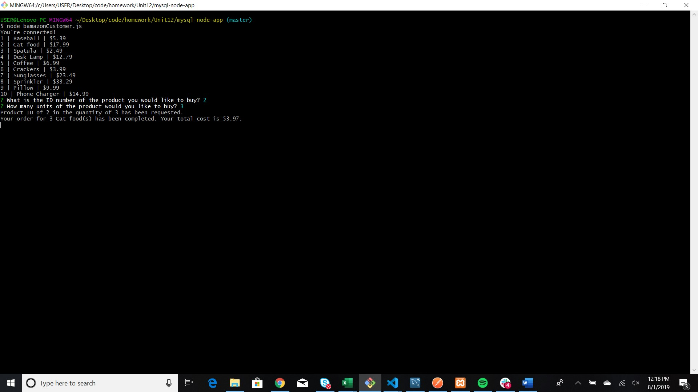

# "Bamazon" Shopping

Bamazon is a command line app where the user interacts with items in the Bamazon database.

## Bamazon Customer

To shop, the user enters: `node bamazonCustomer`. Each item from the `products` table of the `bamazon_db`is listed including the ID, name and price.

* Through Inquirer, the user is asked to identify the ID number and quantity of the item they would like to purchase.

* If there is enough quantity in stock, then the purchase is made.
* The database is updated to reflect the change in quantity and total sales for the product purchased.

* If there is not enough quantity, the user will receive an insufficient quantity message.

 